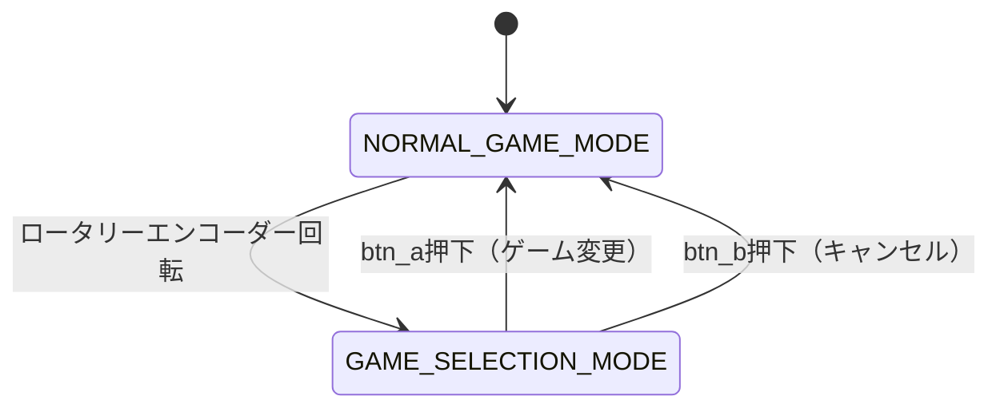

# Design Document

## Overview

ロータリーエンコーダーによるゲーム選択機能は、既存のゲームループに統合される状態管理システムとして設計されます。この機能は、通常のゲーム実行モードとゲーム選択モードの 2 つの状態を持ち、ロータリーエンコーダーの回転によって状態遷移を行います。

## Architecture

### システム状態

システムは以下の 2 つの主要な状態を持ちます：

1. **通常ゲームモード** (`NORMAL_GAME_MODE`)

   - 選択されたゲームが実行される状態
   - ゲームの`update()`メソッドが呼び出される
   - ロータリーエンコーダーの回転を監視

2. **ゲーム選択モード** (`GAME_SELECTION_MODE`)
   - ゲームが一時停止される状態
   - 7 セグメントディスプレイにゲーム番号を表示
   - ロータリーエンコーダーでゲーム選択
   - ボタンでゲーム変更またはキャンセル

### 状態遷移図



## Components and Interfaces

### 1. GameSelector クラス

ゲーム選択機能の中核となるクラスです。

```python
class GameSelector:
    def __init__(self, devices: DeviceManager, encoder: rotaryio.IncrementalEncoder, game_list: list):
        self.devices = devices
        self.encoder = encoder
        self.game_list = game_list
        self.current_game_index = 0
        self.selected_game_index = 0
        self.mode = GameSelectorMode.NORMAL_GAME_MODE
        self.last_encoder_position = 0
        self.current_game = None
        self.previous_seg_display = None
```

#### 主要メソッド

- `initialize()`: ゲーム選択機能の初期化
- `update()`: メインループでの状態管理
- `handle_encoder_rotation()`: ロータリーエンコーダーの回転処理
- `enter_selection_mode()`: ゲーム選択モードへの移行
- `exit_selection_mode()`: ゲーム選択モードからの復帰
- `change_game()`: ゲームの変更処理
- `cancel_selection()`: ゲーム選択のキャンセル処理

### 2. GameSelectorMode 列挙型

システムの状態を表現する列挙型です。

```python
from enum import Enum

class GameSelectorMode(Enum):
    NORMAL_GAME_MODE = "normal"
    GAME_SELECTION_MODE = "selection"
```

### 3. 既存コンポーネントとの統合

#### DeviceManager の拡張

7 セグメントディスプレイの状態保存・復元機能を追加します。

```python
class DeviceManager:
    # 既存のメソッド...

    def save_seg_display(self):
        """現在の7セグメントディスプレイの状態を保存"""
        pass

    def restore_seg_display(self, saved_state):
        """7セグメントディスプレイの状態を復元"""
        pass
```

#### Game インターフェースの拡張

ゲームの一時停止・再開機能を追加します。

```python
class Game:
    # 既存のメソッド...

    def pause(self):
        """ゲームを一時停止"""
        pass

    def resume(self):
        """ゲームを再開"""
        pass
```

## Data Models

### ゲーム選択状態データ

```python
@dataclass
class GameSelectionState:
    current_game_index: int
    selected_game_index: int
    mode: GameSelectorMode
    last_encoder_position: int
    saved_seg_display: Optional[Any]
    is_paused: bool
```

### 7 セグメントディスプレイフォーマット

ゲーム選択モード時の 7 セグメントディスプレイ表示形式：

```
位置: [1] [2] [3] [4]
表示: [-] [ゲーム番号の十の位] [ゲーム番号の一の位] [-]

例：
- ゲーム1: [-] [0] [1] [-]
- ゲーム12: [-] [1] [2] [-]
```

## Error Handling

### エラーケースと対応

1. **ロータリーエンコーダー読み取りエラー**

   - エラーをログに記録し、前回の値を使用
   - 連続エラー時は機能を無効化

2. **ゲーム初期化エラー**

   - エラーメッセージを 7 セグメントディスプレイに表示
   - 前のゲームに戻る

3. **7 セグメントディスプレイエラー**
   - エラーをログに記録し、処理を継続
   - LED マトリクスでの代替表示を検討

### エラー処理の実装方針

```python
def safe_encoder_read(self):
    """安全なエンコーダー読み取り"""
    try:
        return self.encoder.position
    except Exception as e:
        print(f"Encoder read error: {e}")
        return self.last_encoder_position

def safe_game_initialize(self, game_class):
    """安全なゲーム初期化"""
    try:
        game = game_class(self.devices)
        game.initialize()
        return game
    except Exception as e:
        print(f"Game initialization error: {e}")
        return None
```

## Testing Strategy

### 単体テスト

1. **GameSelector クラスのテスト**

   - 状態遷移の正確性
   - エンコーダー回転の検出
   - ボタン入力の処理

2. **ゲーム選択ロジックのテスト**
   - ゲーム番号の循環処理
   - 7 セグメントディスプレイの表示形式

### 統合テスト

1. **既存ゲームとの統合テスト**

   - 各ゲームでの一時停止・再開機能
   - ゲーム切り替え時の状態保持

2. **ハードウェア統合テスト**
   - ロータリーエンコーダーの物理的な動作
   - 7 セグメントディスプレイの表示確認

### テストシナリオ

1. **基本操作フロー**

   - ゲーム実行中にエンコーダーを回転
   - ゲーム選択モードでの番号変更
   - btn_a でのゲーム変更
   - btn_b でのキャンセル

2. **エッジケース**

   - 最初/最後のゲームでの循環処理
   - 同じゲームの再選択
   - 連続的なエンコーダー回転

3. **エラーケース**
   - 存在しないゲームの選択
   - ハードウェアエラー時の動作

## Implementation Notes

### パフォーマンス考慮事項

1. **エンコーダー読み取り頻度**

   - メインループでの毎フレーム読み取り
   - 変化検出による処理の最適化

2. **7 セグメントディスプレイ更新**

   - 表示内容変更時のみ更新
   - 不要な描画処理の削減

3. **ゲーム状態管理**
   - 一時停止時のメモリ使用量最小化
   - 状態復元の高速化

### 既存コードとの互換性

1. **最小限の変更**

   - 既存のゲームクラスへの影響を最小限に抑制
   - Game インターフェースの後方互換性維持

2. **段階的な実装**
   - まず基本的な選択機能を実装
   - その後、一時停止・再開機能を追加

### メモリ使用量の最適化

1. **状態データの最小化**

   - 必要最小限のデータのみ保存
   - 不要なオブジェクトの即座な解放

2. **ゲームインスタンスの管理**
   - アクティブなゲームのみメモリに保持
   - 非アクティブゲームの適切な解放
